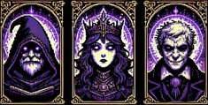

# Ink and Incantation
## Table of Contents
- [CMUB](#community-made-updates-branch)
- [Introduction](#introduction)
- [Opponents](#opponents)
  - [Enchanter](#enchanter)
  - [Monarch](#monarch)
  - [Madman](#madman)
- [Setup](#setup)
  - [Prerequisites](#prerequisites)
  - [Mods](#modding)
- [Resetting Your Save](#resetting-your-save)
- [Credits](#credits)

## Community Made Updates Branch
This is a Branch for Community made modifications, As this isnt being sold there is no monetary gain for posting Code here. 
This Branch is open for everyone to PR into, and is welcoming of new and experienced programmers alike. 
Feedback is welcome but must be constructive. 
- Elementus
## Introduction
=======
Dive into this new world taking place in the pages of a book, battling the Enchanter, Madman and the Monarch

## Opponents

### Enchanter
Your first opponent  
His quick thinking makes him a Formidable Foe, by far the smartest although he only serves to teach 
The hand that guides is the first to leave

### Monarch
Your second opponent 
She lives to serve her people, only attacking when provoked, she sees the book as a game, without understanding the consequences 
failure to entertain will only result in your death

### Madman
Your Final opponent 
Locked away for years, he hears the world around him tick, like a clock. 
The veil breaks

## Setup

### Prerequisites
- Ensure you have Python installed (originally built with Python 3.11.9).
- Add Python to your system's PATH during installation.

### Modding
- Drag and Drop your selected mod into the mods folder
- you will be prompted what version of I&I you wish to play when you run the game
- Mods can be found [here](https://xliam.space/iaimods.html), Thanks Liam!

on your first time running, I reccomend running SaveUpdater.py to ensure your save file is fresh
## Resetting Your Save
THIS WILL RESET ALL YOUR PROGRESS, THIS ACTION IS NOT REVERSEABLE  
Run SaveUpdater.py to reset your save file

## Credits
- **Director, Developer, and Artist**: Elementus
- **ModLoader Developer and Mod Spearhead**: Liam (Typhoonz0)
- **Modifications**: You guys!  
- **Music**:
  - [DeusLower](https://www.youtube.com/@DeusLower)
  - [Erang](https://www.youtube.com/channel/UC0xBatTv8HbChLQukeerUCg)
    - *Check out their amazing work!*
- **Status**: This game is a work in progress and is part of an assessment item.
- **Contributions**: Please make pushes to the `community-made-updates` branch.
